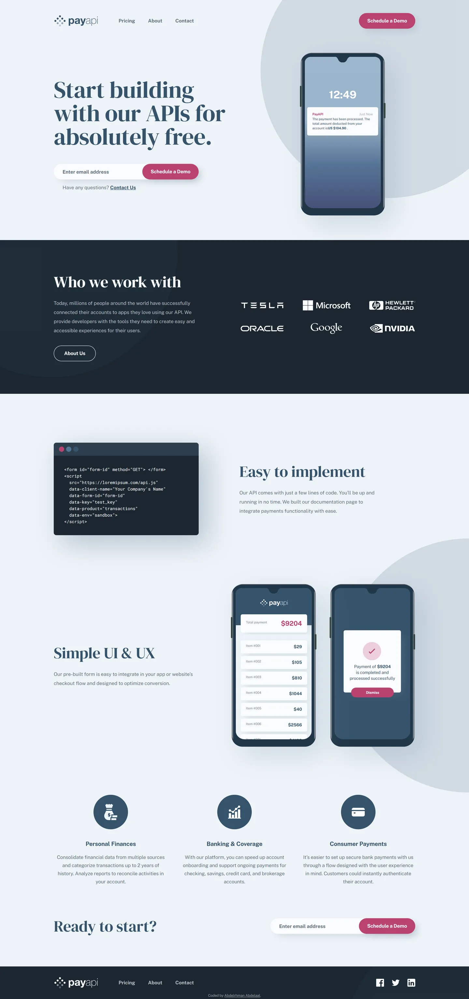

# PayAPI multi-page website

A solution to the [PayAPI multi-page website challenge on Frontend Mentor](https://www.frontendmentor.io/challenges/payapi-multipage-website-FDLR1Y11e).

- Live site: https://payapi-multi-page-website.abdelrhman-ahmed8881.workers.dev
- Code: https://github.com/MrBlackvanta/payapi-multi-page-website

## Built with

- Next.js (App Router, static export)
- React
- TypeScript
- Tailwind CSS

## Notes

_To be written with the final section._

## Author

- LinkedIn: [Abdelrhman Abdelaal](https://www.linkedin.com/in/abdelrhman-vanta/)
- Frontend Mentor: [@MrBlackvanta](https://www.frontendmentor.io/profile/MrBlackvanta)
